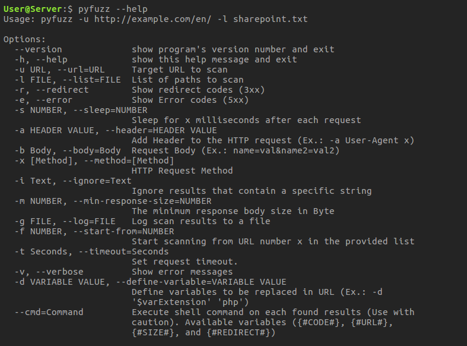

# pyFuzz v1.0.3

URL fuzzing tool made of Python.

This tool needs Python v3 to work, and it should work fine in Linux, Windows, and Mac.

URL fuzzing a technique used to discover hidden files/directories in a webserver.
Example of those files, you might find database/webserver backupfiles, log files, testing pages, etc...




**WARNING**: Performing a fuzzing attack on webserver without permission is illegal and could lead to a lawsuit.

### Features

 - Ability to Only Show pages with response code 200.
 - Show redirect pages (Code 3xx)
 - Show pages with Internal Error (Code 5xx).
 - Set sleep time between requests.
 - Add multiple custom Header values (Ex.: User-Agent, Cookies, etc...).
 - Add a request parameters (Ex.: name=val&name2=val2).
 - Set a request method (Ex.: POST, GET, PUT, etc...).
 - Ignore findings that contains a specific text in the response.
 - Ignore findings with response size smaller than X Bytes.
 - Log finding in a file.
 - Ability to start scanning from specific line number in the provided list (Useful after a crash in the middle of a scan).
 - Set request timeout.
 - Ability to set variables to be replaces with value while fuzzing.
 - Ability to execute shell command on each found URL.

If you have a new feature you'd like to see, please submit an issue.

-------

### Install (Linux)

Simply clone the repository to the location you want:
(Example: you want to place it in `~/apps/`
```Bash
mkdir -p ~/apps/
cd ~/apps/
git clone https://github.com/ayoobali/pyfuzz
cd pyfuzz
chmod +x pyfuzz.py
./pyfuzz.py
```

*To run the application from any directory, just create a symlink of `pyfuzz.py` in your bin directory.*

```Bash
ln -s ~/apps/pyfuzz/pyfuzz.py ~/bin/pyfuzz
```


OR One line installation:

```bash
mkdir -p ~/bin/ && mkdir -p ~/apps/ && cd ~/apps/ && git clone https://github.com/ayoobali/pyfuzz && cd pyfuzz && chmod +x pyfuzz.py && ln -s ~/apps/pyfuzz/pyfuzz.py ~/bin/pyfuzz
```


### Usage

To fuzz a URL:
```Bash
pyfuzz -u <URL> -l </Path/To/List/File.txt>
```

To fuzz a URL and only show findings with page size above 500 Bytes"
```Bash
pyfuzz -u <URL> -l </Path/To/List/File.txt> -m 500
```

To fuzz a URL and ignore findings that contains specific string (Ex.: 'This page does not exist')
```Bash
pyfuzz -u <URL> -l </Path/To/List/File.txt> -i 'This page does not exist'
```

To download a copy of the found URL's
```Bash
pyfuzz -u <URL> -l </Path/To/List/File.txt> --cmd 'wget "{#URL#}"'
```

For more options:
```Bash
pyfuzz -h
```

-------

### Change LOG

[10-06-2019] v1.0.3

   - [Changed] Error messages now shows the number of the current item of the list.
   - [Fixed]   Timeout was not implemented for `http` URL's.
 
[07-02-2019] v1.0.2

   - [Added]   Option to Execute a shell command on each found URL `--cmd`.
   - [Fixed]   Fixed a bug in detecting default return code status.

[07-01-2019] v1.0.1

   - [Added]   Option to set value for variables in the list (-d)
   - [Fixed]   Minor improvement in the way of displaying the progress.

[07-01-2019] v1.0.0

   - [Added]   Option to ignore findings with response size smaller than X Bytes (-m).
   - [Added]   Option to set request timeout (-t).
   - [Added]   Option to save output to a file (-g).
   - [Added]   Option to Start scanning from specific line number (-f).
   - [Added]   New list files (aps.txt, php.txt, directories.txt, others.txt, sharepoint.txt, short.txt)
   - [Added]   Shebang to the python script so it can run directly from the terminal.
   - [Changed] List files are stored in a directory called 'lists'.
   - [Removed] Old list files.
   - [Removed] Bash script that runs pyfuzz.py as it's not needed anymore.

[24-07-2018] v0.5.1

   - [Added] Option to ignore results that contain a specific string in the response body (-i).

[23-07-2018] v0.5.0

   - [Added] Option to add Custom Header to the request (-a).
   - [Added] Option to Change the HTTP Request Method (-x).
   - [Added] Option to add a Request Body (-b).
   - [Fixed] First random page to check response code now randomly generated.
   - [Fixed] Minor issue.


### TO-DO:

   - Add multi-threading option.
   - Add a spider option.
   - ~~Add option to replace variables in the provided list (Ex.: Replace "somepage.{#ext}" with "somepage.php").~~
   - ~~Add the ability to filter results based on a string in the response body.~~
